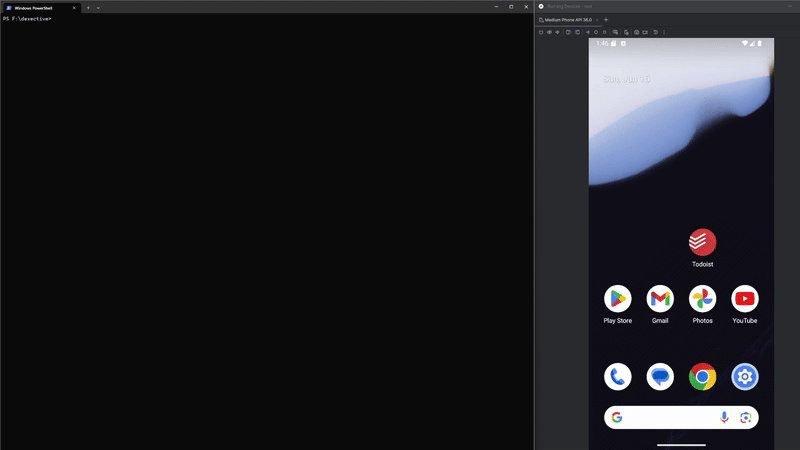
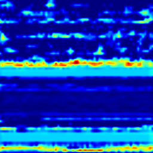
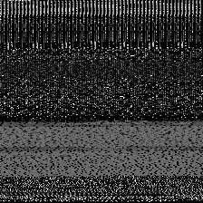
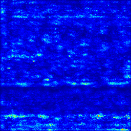

# dexective: Visual Malware Localization & Scanning Tool

**dexective** is a command-line tool for analyzing Android applications (`.apk` files). It operates in two modes:

- **`scan`** mode for rapid classification
- **`analyze`** mode to identify and finely localize potentially malicious code

It transforms the app’s `classes.dex` into a grayscale image, classifies it with a CNN, and—if malicious—applies an ensemble of Explainable AI (XAI) techniques to pinpoint the exact Smali classes responsible.


[](https://www.youtube.com/watch?v=13ysN18IwLA)

---

## 📷 Workflow Overview

<details>
<summary>Click to expand</summary>

1. **DEX → Image**  
   Convert `classes.dex` bytes into a 2D grayscale image.
2. **CNN Classification**  
   Classify the DEX image as **Benign** or **Malicious**. (End of `scan` mode.)
3. **XAI Localization**  
   If malicious, run XAI methods (e.g., Grad-CAM++) to generate heatmaps highlighting suspicious regions.
4. **Heatmap → Smali**  
   Map “hot” pixels back to specific Smali classes for precise localization.  

  
*Figure: DEX image by Dexective.*

  
*Figure: Hotspots on the DEX image detected by Dexective.*


</details>

---

## 🚀 Features

- **Dual-Mode Operation**:
  - `scan` for bulk, fast classification
  - `analyze` for deep localization with XAI
- **Static-Only Analysis**: No APK execution required
- **High-Accuracy CNN**: State-of-the-art DEX–image classifier
- **Rich CLI**: Tables, progress bars, and colorized output via Typer & Rich
- **Flexible Inputs**: Local files, single `adb` package, or `adb-all`
- **XAI-Powered Localization**: Grad-CAM++ pinpointing of malicious Smali classes
- **Detailed Reports**: Text summaries + PNG heatmaps

---

## 📋 Prerequisites

- **Python 3.8+**
- **ADB** (for `adb` / `adb-all` modes)
- **Java JRE** (required by `analyze`)
- **Keras `.h5` model** for classification
- **`baksmali.jar`** for Smali decompilation (required by `analyze`)

Install dependencies:

```bash
pip install -r requirements.txt
```

Key libraries:
- `tensorflow`, `tf-keras-vis`
- `typer`, `rich`
- `opencv-python`, `matplotlib`
- `scikit-learn`, `pyfiglet`
- `androguard` (optional)

---

## 📥 Installation

```bash
git clone https://github.com/your-username/dexective.git
cd dexective
python -m venv venv
source venv/bin/activate      # Windows: venv\Scripts\activate
pip install -r requirements.txt
```

Place `model.h5` and `baksmali.jar` in the repo root (or point to them via CLI args).

---

## 💻 Usage

Dexective offers two sub-commands: `scan` and `analyze`.

### 1. Quick Scan (Fast Classification)

Does **not** require `baksmali.jar`.

**Scan a single APK:**

```bash
python dexecutive.py scan file \
  --model /path/to/model.h5 \
  /path/to/sample.apk
```

**Scan all third‑party apps on a device:**

```bash
python dexexecutive.py scan adb-all \
  --model /path/to/model.h5 \
  --output-dir ./scan_results
```

_Output is printed to the console._

---

### 2. Full Analysis (XAI Localization)

**Requires** `--baksmali baksmali.jar`.

**Analyze one APK:**

```bash
python dexecutive.py analyze file \
  --model /path/to/model.h5 \
  --baksmali /path/to/baksmali.jar \
  --output-dir ./analysis_results \
  /path/to/malicious.apk
```

**Analyze all installed apps:**

```bash
python dexecutive.py analyze adb-all \
  --model /path/to/model.h5 \
  --baksmali /path/to/baksmali.jar \
  --output-dir ./analysis_results
```

---

## 📂 Output Structure (Analyze Mode)

\`\`\`
analysis_results/
├─ adb_pulled_apks/
│  └─ com.example.app.apk
├─ report_com.example.app.txt      # Ranked suspicious classes
└─ com.example.app_heatmap.png     # Grad-CAM++ heatmap
\`\`\`

---

## 📖 License

MIT
